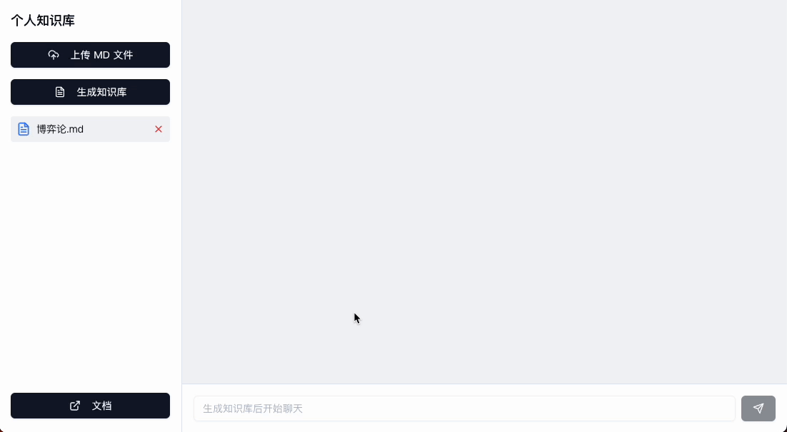
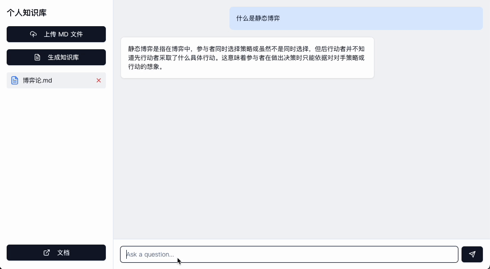
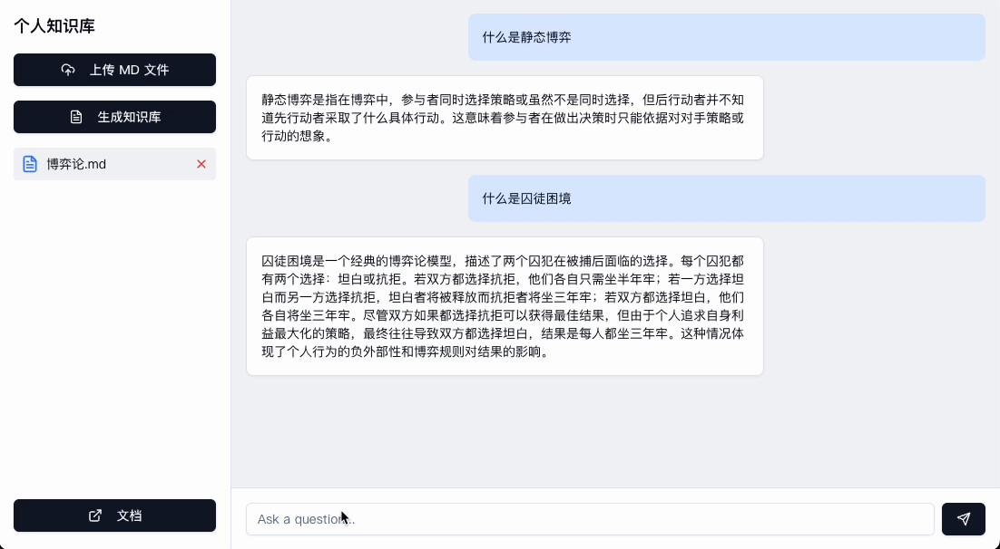

### 项目说明

1. 项目使用 FastAPI 框架, 实现 web 服务后端
2. 项目使用 LangChain 框架，实现文档的 Embedding 和问答

### 项目结构

```
.
├── app
│   ├── __init__.py
│   ├── config.py
│   ├── embedding_manager.py
│   ├── document_loader.py
│   ├── qa_chain.py
│   ├── main.py
```

### 项目运行

```
python run.py
```

### 功能演示

#### 上传文件&生成知识库



#### 提问（基于文件）



#### 提问（无关问题）


